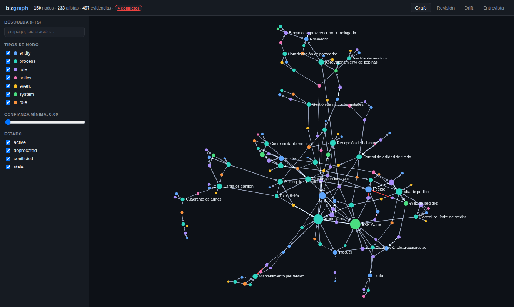
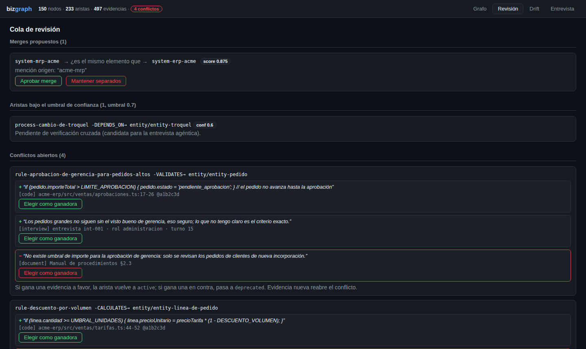

# untacit

**untacit** is a local-first, repo-first tool that builds a **typed ontological
graph of an organization's business logic** from three sources — source code,
internal documents, and tacit knowledge captured through agentic interviews —
and exposes it through a desktop app and an MCP server for agents.



Business logic doesn't live anywhere queryable: it is scattered across
conditionals buried in code, manuals nobody updates, and people's heads. The
consequences are slow onboarding, orphan rules nobody can explain, invisible
contradictions (the code does X, the manual says Y, the person does Z), agents
with no business context, and silent drift between policy and implementation.

The thesis: **a typed graph with mandatory provenance is the right
representation** — every edge knows which file, document or interview it came
from, with a literal excerpt and a confidence score. Contradictions are
first-class citizens: when sources disagree, the edge enters `conflicted`
state and a human resolves it from a review queue. Full design docs (Spanish)
live in [`docs/`](docs/).

## How it works

```
 sources            extraction               core                    consumption
 repos git   ──▶  extractor-code   ──▶  validator (closed         desktop app (Tauri +
 documents   ──▶  extractor-docs        ontology, domain→range)   React + Sigma.js)
 people      ──▶  extractor-interview →  entity resolver        ◀▶
                  (engine: Claude Code, canonical serializer      MCP server (stdio +
                  strict JSON batches)        │                   streamable HTTP)
                                              ▼
                                    GRAPH REPO (git): one markdown file per node,
                                    deterministic serialization, one run = one commit
                                    .untacit/index.db  (derived SQLite, gitignored)
```

- **Closed ontology v1**: 7 node types (`entity`, `process`, `rule`, `policy`,
  `event`, `system`, `role`), 9 edge types with domain→range restrictions. The
  validator rejects anything outside the schema before it touches disk.
- **Repo-first**: the canonical graph is plain markdown files in a dedicated
  git repo. GitHub is the only "cloud". SQLite (FTS5) is a derived,
  regenerable index. Re-importing identical data leaves `git status` clean —
  idempotence is a tested invariant.
- **Provenance is mandatory**: no edge exists without evidence. Multi-source
  evidence raises confidence (code 0.9, documents 0.7, interviews 0.6, live
  validated 0.95, +0.05 per extra source type, ceiling 0.99).
- **Humans validate the doubtful**: entity merges, low-confidence edges and
  conflicts land in a review queue; nothing is silently auto-resolved.



## Monorepo

| Package | Contents |
|---|---|
| [`packages/core`](packages/core) | Types & ontology constants, canonical serializer, batch validator, graph store, entity resolver with reversible merges, conflict resolution, derived SQLite index (BM25F fielded FTS5, RM3 pseudo-relevance query expansion, incremental node + facet embeddings, late-interaction MaxSim, weighted-RRF hybrid search), graph-retrieval algorithms (spreading activation, personalized PageRank, k-best weighted paths, spectral structural embeddings, MMR), ontology diff over git, import pipeline |
| [`packages/cli`](packages/cli) | `untacit init \| import \| index \| embed \| stats \| search \| conflicts \| diff \| extract \| interview \| serve-mcp \| update` |
| [`packages/mcp`](packages/mcp) | MCP server (stdio + streamable HTTP): `untacit_context` (multi-stage hybrid retrieval), `untacit_explore`, `untacit_impact`, `untacit_paths` (strongest evidence chains between two concepts), `untacit_similar` (semantic + structural + lexical similarity), `untacit_evidence`, `untacit_diff`, `untacit_conflicts`; agent surface for host models — `untacit_interview_gaps`, `untacit_code_candidates`, `untacit_doc_sections`, versioned prompts; full write surface behind `--write` — `untacit_import_batch`, `untacit_review_queue`, `untacit_merge_accept/reject/revert`, `untacit_conflict_resolve` (every graph write, each landing as a git commit) |
| [`packages/extractors`](packages/extractors) | Code / docs (PDF, Markdown, docx with section/page locators) / interview extraction agents. Engine = Claude Code (local CLI, no API key); pluggable LLM client, strict schema emission |
| [`packages/app`](packages/app) | Desktop app: Tauri 2 shell (system tray, native folder picker, Windows NSIS installer) + React + Sigma.js + self-contained Node sidecar |
| [`packages/server`](packages/server) | Self-hosted MCP server over Streamable HTTP: one instance per company, multi-graph (`/graphs/<id>/mcp`), local users + OAuth 2.1 (PKCE, opaque rotating tokens), per-graph grants with an optional write level (`grant <user> <graph> --write` + `"write": true` per graph serves the full write surface), background embedding refresh; Docker artifacts in [`deploy/`](deploy) |
| [`examples/acme-manufactura`](examples/acme-manufactura) | Synthetic dataset (fictitious manufacturer): 6 batches, **150 nodes, 233 edges**, 4 designed conflicts, review queue populated, 10 eval questions, [demo script](examples/acme-manufactura/DEMO.md) |
| [`docs/`](docs) | Vision/PRD, ontology spec, architecture, phase plan, drift & extraction-as-PR guide, privacy audit, self-hosted server design + deployment guide, Windows desktop-app guide |

## Install

One-line guided installers for the CLI. They detect the dependencies —
git, Node.js ≥ 20, pnpm, plus the optional Claude Code CLI (agent engine
for `extract` / `interview`) — install what they safely can (pnpm via
corepack/npm, git/Node via winget on Windows) and print the exact command
for anything they can't; then they clone, build, and put `untacit` and
`untacit-mcp` on your PATH.

**Windows (PowerShell):**

```powershell
powershell -ExecutionPolicy Bypass -c "irm https://raw.githubusercontent.com/rflvz/untacit/main/install.ps1 | iex"
```

**macOS / Linux:**

```bash
curl -fsSL https://raw.githubusercontent.com/rflvz/untacit/main/install.sh | bash
```

Everything lands under `~/.untacit` (`%LOCALAPPDATA%\untacit` on Windows);
run the script from inside a clone of this repo and it builds in place
instead of cloning. Flags (`--flag` on Unix, `-Flag` on Windows):
`--ref <branch|tag>`, `--dir <path>`, `--yes`, `--no-path`, `--uninstall`.

### Updating

Once installed, the CLI updates itself in place — no need to re-run the
installer:

```bash
untacit update --check   # is there a newer version? (changes nothing)
untacit update           # fetch + rebuild the install checkout
untacit update --ref v0.2.0   # pin a specific tag/branch
```

The desktop app checks GitHub Releases on startup and shows an
"Actualizar a X" chip in the top bar when a new version is published — one
click downloads and runs the new installer. You can also check on demand
from the tray menu ("Buscar actualizaciones…").

## Quickstart

With the installer above, `untacit …` on your PATH replaces the
`node packages/cli/dist/bin.js …` invocations below (they are equivalent —
the quickstart assumes a manual build):

```bash
pnpm install && pnpm build && pnpm test

# Create a graph repo and import the synthetic dataset (150 nodes, 6 runs)
node packages/cli/dist/bin.js init /tmp/acme-graph
for b in examples/acme-manufactura/batches/*.json; do
  node packages/cli/dist/bin.js import "$b" --graph /tmp/acme-graph
done

node packages/cli/dist/bin.js stats     --graph /tmp/acme-graph
node packages/cli/dist/bin.js search prepago --graph /tmp/acme-graph
node packages/cli/dist/bin.js conflicts --graph /tmp/acme-graph   # ← the product working
node packages/cli/dist/bin.js diff HEAD~1 HEAD --graph /tmp/acme-graph

# Embeddings + semantic / hybrid retrieval. The workspace ships
# @huggingface/transformers, so the local multilingual model (e5-small,
# ~100 languages) works out of the box: --provider auto downloads and caches
# it on first use. The hash provider remains the offline/deterministic option.
node packages/cli/dist/bin.js embed --graph /tmp/acme-graph --provider hash
node packages/cli/dist/bin.js search "pago anticipado" --mode hybrid --graph /tmp/acme-graph

# Extract business logic from documents (PDF / Markdown / docx)
node packages/cli/dist/bin.js extract docs manual.pdf --sections-only

# Extract business logic from a source repo (heuristic candidates → agent);
# --paths scopes the scan for partial re-extraction, --branch commits the run
# on its own branch of the graph repo (extraction-as-PR, docs/05)
node packages/cli/dist/bin.js extract code ../web-pedidos --candidates-only
node packages/cli/dist/bin.js extract code ../web-pedidos --paths src/checkout.ts \
  --import --graph /tmp/acme-graph --branch
# Automate it after every merge in a source repo: examples/hooks/post-merge

# Agentic interview in the terminal (engine = your local Claude Code; --gaps-only is offline)
node packages/cli/dist/bin.js interview --graph /tmp/acme-graph --gaps-only
node packages/cli/dist/bin.js interview --graph /tmp/acme-graph --role administracion

# Or drive extraction/interviews from Claude Code / Claude Desktop over MCP
# (agent tools + versioned prompts; --write enables the full write surface —
#  import gate + review actions — and --http serves streamable HTTP instead of stdio)
node packages/mcp/dist/bin.js --graph /tmp/acme-graph --write
node packages/mcp/dist/bin.js --graph /tmp/acme-graph --write --http --port 8765

# Read-only MCP server for agents (e.g. claude mcp add untacit -- node .../mcp/dist/bin.js --graph ...)
node packages/mcp/dist/bin.js --graph /tmp/acme-graph

# Desktop app (browser dev mode)
UNTACIT_REPO=/tmp/acme-graph pnpm --filter @untacit/app dev
```

### Desktop app on Windows

Download `untacit_<version>_x64-setup.exe` from
[Releases](https://github.com/rflvz/untacit/releases) (built by
[`desktop.yml`](.github/workflows/desktop.yml) on every `v*` tag) — a
per-user NSIS installer, no admin rights needed. Only requirement:
[Node.js ≥ 20 LTS](https://nodejs.org) (the app tells you if it's missing).
On first run you pick the graph-repo folder with the native dialog (no env
vars, no terminal); the app then lives in the system tray, remembers recent
graphs and lets you switch folders from the top bar or the tray menu.
Install & usage guide, build-from-source and troubleshooting:
[`docs/08-guia-app-escritorio-windows.md`](docs/08-guia-app-escritorio-windows.md).

### Self-hosted server (teams)

Serve your graphs to the whole team over the network instead of per-machine
clones: one Docker instance per company exposes each graph at
`https://untacit.example.com/graphs/<id>/mcp` (Streamable HTTP) with local
users, browser login (OAuth 2.1 + PKCE) and per-user graph grants. The
standard image ships the local embedding model pre-seeded, so hybrid
retrieval works air-gapped and embeddings refresh themselves after every
`git pull` of a graph.

```bash
docker build -f deploy/Dockerfile -t untacit-server .
cd deploy && mkdir -p data graphs && cp config.example.json data/untacit-server.config.json
docker compose up -d
docker compose exec untacit untacit-server user add ana
docker compose exec untacit untacit-server grant ana acme          # read-only
docker compose exec untacit untacit-server grant ana acme --write  # + write surface (graphs with "write": true)
claude mcp add --transport http acme https://untacit.example.com/graphs/acme/mcp
```

Full guide: [`docs/07-guia-despliegue-autoalojado.md`](docs/07-guia-despliegue-autoalojado.md).

The guided ~10-minute walkthrough (conflicts, impact analysis, MCP, drift) is
in [`examples/acme-manufactura/DEMO.md`](examples/acme-manufactura/DEMO.md).
Dataset invariants are verified end-to-end by
`node examples/acme-manufactura/check.mjs`; the 10 Fase 5 eval questions are
verified against the real MCP server (tools + structuredContent) by
`node examples/acme-manufactura/evals/run.mjs`. Both run in CI.

## Benchmark: the same questions, with and without untacit

The dataset ships 10 business questions with verifiable answers
([`evals/evals.json`](examples/acme-manufactura/evals/evals.json)) — e.g. *"is
the 15% urgent-order surcharge still in force?"* (it's in conflict: the code
still applies it, newer sources say it was dropped).

Two runners:

```bash
# Deterministic (no LLM, runs in CI): executes every eval's verification
# recipe as real MCP tool calls against the live server. Current result: 10/10.
node examples/acme-manufactura/evals/run.mjs

# Agentic (CodeGraph-style): the same engine (your local Claude Code CLI,
# no API key) answers each question twice — with only the untacit MCP query
# tools (no source access) vs. bare. Reports accuracy and agent turns per
# condition to benchmark/results.md.
node examples/acme-manufactura/benchmark/run-benchmark.mjs
```

The LLM half of the gate — Claude Code connected only to the MCP, 10/10 — is
recorded in
[`evals/RESULTS.md`](examples/acme-manufactura/evals/RESULTS.md).

Without the graph the model can only guess at organization-specific rules
(thresholds, exceptions, whether a rule is still in force); with
`untacit_context` / `untacit_conflicts` / `untacit_evidence` it answers
from cited excerpts. Last recorded run over the 150-node graph
([`benchmark/results.md`](examples/acme-manufactura/benchmark/results.md)):
**with untacit 9/10 (40 agent turns), without 0/10**.

## Status

Built against the phase plan in [`docs/04-plan-de-fases.md`](docs/04-plan-de-fases.md):

- **Fase 0 (cimientos)** — complete, exit criteria automated (import + stats +
  FTS + validator rejection + idempotent re-import with clean `git status`).
- **Fase 1–4 building blocks** — extractors implemented with a pluggable LLM
  client whose engine is the local Claude Code CLI (print mode, no API key;
  mock client in tests). The Fase 1 gate (≥80% correct edges on a real repo)
  requires real source data and remains open.
- **Fase 3 (documentos + resolución de entidades)** — engineering complete,
  exit criteria automated in the example dataset: extractor-docs ingests
  PDF/Markdown/docx with section/page locators; full resolver (exact → fuzzy →
  gray zone with reversible merges); node-embedding pipeline in the derived
  index (local multilingual model via transformers.js, pluggable, incremental
  by content hash; deterministic hash provider for offline use); review queue
  with merge and conflict-resolution actions. The run over a real internal
  document batch requires real source data and remains open.
- **Fase 4 (entrevistas agénticas)** — engineering complete: the interviewer
  agent implements the full docs/03 §4.3 protocol — gap-driven target
  selection over the derived index, question script generation, a
  conversational loop that extracts triples and asks follow-ups until
  statements carry condition and consequence, live accept/edit/reject (bulk
  with exceptions), and cross-verification of existing low-confidence edges
  (confirm → `validated_by` evidence, confidence 0.95; refute → `contradicts`
  evidence → conflict). Runs in the app (chat + proposal panel over the
  sidecar) and in the terminal (`untacit interview`); the engine is the
  local Claude Code CLI (no API key), and any MCP host (Claude Code, Claude
  Desktop) can run the whole flow itself through the agent tools + prompts
  of the MCP server with `--write`. Transcripts never
  persist; evidence stores role + excerpt only. The two real interviews of the
  exit criteria require real people and remain open.
- **Fase 5 (MCP + drift)** — complete. Eight query tools with Zod schemas,
  structuredContent and read-only annotations; `untacit_context` uses
  multi-stage hybrid retrieval (weighted RRF over four channels — BM25F
  fielded lexical, RM3 pseudo-relevance expansion, mean-pooled semantic
  k-NN and ColBERT-style late-interaction MaxSim over per-facet vectors —
  then MMR seed diversification and spreading activation blended with
  personalized PageRank over confidence- and type-weighted edges);
  `untacit_paths` ranks the strongest evidence chains between two concepts
  and `untacit_similar` blends semantic, structural (neighborhood overlap +
  spectral graph embeddings) and name similarity as a duplicate lens. Drift over
  git in CLI (`untacit diff`), app (drift view) and MCP (`untacit_diff`),
  presented in ontology terms. Partial re-extraction: `extract code --paths`
  (also `paths` on the `untacit_code_candidates` MCP tool) plus an example
  post-merge hook ([`examples/hooks/post-merge`](examples/hooks/post-merge)).
  Extraction-as-PR: `import`/`extract code` `--branch` commits the run on its
  own branch of the graph repo, ready to push and review — documented and
  executed end-to-end in
  [`docs/05-drift-y-extraccion-como-pr.md`](docs/05-drift-y-extraccion-como-pr.md).
  Eval gate executed: the 10 read-only evals are verified mechanically against
  the real MCP server in CI (`evals/run.mjs`, 10/10), and Claude Code connected
  only to the MCP answered 10/10
  ([`examples/acme-manufactura/evals/RESULTS.md`](examples/acme-manufactura/evals/RESULTS.md)).
  The drift-on-real-change criterion over the Diseños NT repo requires real
  source data and remains open.
- **Fase 6 (release)** — privacy audit of the full git history
  ([`docs/05-auditoria-privacidad.md`](docs/05-auditoria-privacidad.md), no
  real data ever committed), 150-node demo dataset with
  [demo script](examples/acme-manufactura/DEMO.md), with/without-untacit
  benchmark harness, [MIT license](LICENSE),
  [contributing guide](CONTRIBUTING.md), CI running build + tests + dataset
  verification + evals. The clean-install test on a fresh machine remains
  open.
- **Fase 7 (servidor MCP HTTP autoalojado)** — complete. `@untacit/server`:
  multi-graph Streamable HTTP endpoint with sessions bound to user + graph,
  OAuth 2.1 per the MCP authorization spec (dynamic registration, PKCE S256,
  single-use codes, opaque tokens hashed at rest, refresh rotation with
  reuse detection, immediate revocation), server-rendered login with
  per-transaction CSRF and rate limiting, per-request user→graph grants,
  RFC 9728 metadata per graph and RFC 8707 resource binding, background
  embedding refresh after every reindex, admin CLI
  (`user add | grant | revoke | status`), Docker image with the local
  embedding model pre-seeded (air-gapped hybrid retrieval; SLIM variant
  opt-out) + compose with optional Caddy TLS, smoked in CI. Deployment
  guide: [`docs/07`](docs/07-guia-despliegue-autoalojado.md). **Write mode**:
  the MCP write surface (import gate + review-queue actions: accept/reject/
  revert merges, resolve conflicts) is deployable per graph (`"write": true`)
  and per user (`grant <user> <graph> --write`, checked on every request;
  downgrading kills live write sessions), so any streamable-HTTP MCP host can
  run the full write workflow remotely. The stateless
  Vercel mode remains a designed v1.1 option (docs/06 §4.6).
- **App** — graph, detail, review (merges + low confidence + conflict
  resolution), drift and interview (chat + live triple validation) views
  working against the sidecar; Tauri shell scaffolded.

## License

[MIT](LICENSE). Contributions welcome — see [CONTRIBUTING.md](CONTRIBUTING.md).
